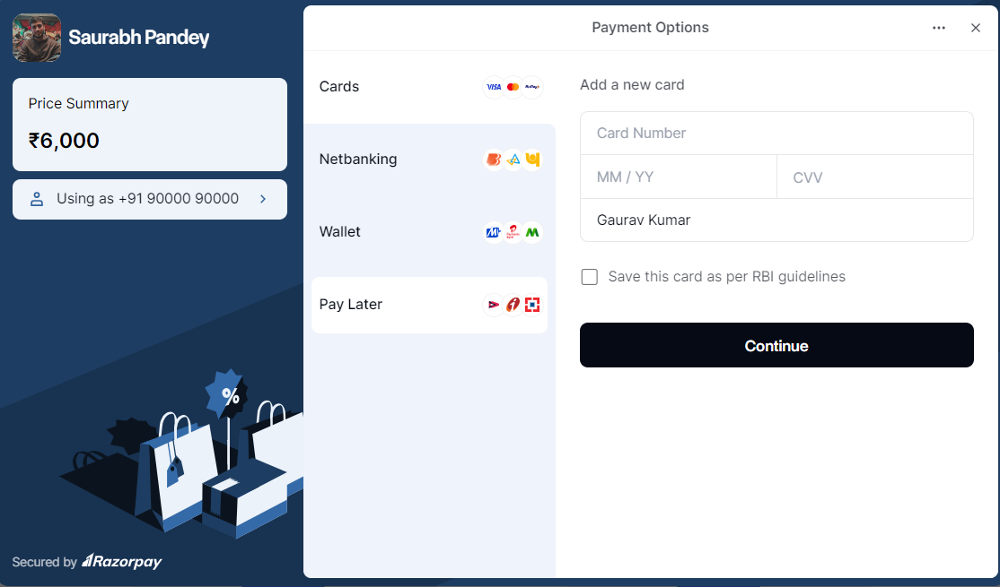

# Razorpay Payment Integration
Created by: **Rishita**

## Description
This project demonstrates how to integrate the Razorpay payment gateway in a full-stack application with a Node.js backend and a React frontend.





## Prerequisites
Make sure you have the following installed on your local machine:
- Node.js (version 14 or higher)
- npm (Node package manager)

## Running the Project

Follow these steps to get a copy of the project up and running on your local machine:

1. **Clone the repository:**
   ```bash
   git clone https://github.com/saurabh-1907/razorpay.git
   ```

2. **Navigate to the project directory:**
   ```bash
   cd razorpay
   ```
   **Check for nested folders**

3. **Install Node modules for the client:**
   ```bash
   cd client
   npm install
   ```

4. **Install Node modules for the server:**
   ```bash
   cd ../server
   npm install
   ```

5. **Run the client:**
   ```bash
   cd ../client
   npm run dev
   ```

6. **Run the server:**
   ```bash
   cd ../server
   npm start
   ```
### Test Card Information

You can use the following test card details for transactions:

- **Card Number:** 4111111111111111
- **CVV:** 123
- **Name:** Gaurav Kumar
- **Expiry Date:** 12/36 (Any future date)
- **OTP:** 112123

## Testing the Payment Integration
Once both the client and server are running, you can test the payment integration by navigating to the client URL (usually `http://localhost:5173`) in your web browser.


